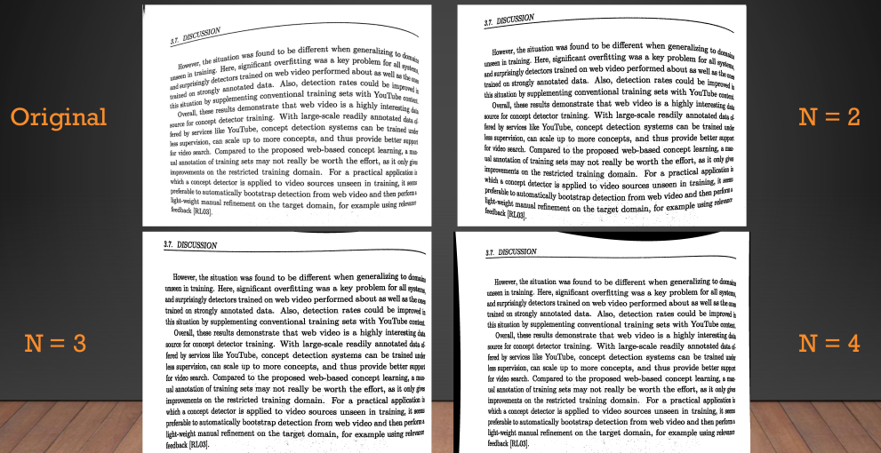

## Text Image Dewarping Project
This project aims to develop a MATLAB algorithm that flattens any warped image containing text.
The goal is to make the text in original image more readable for humans and OCR (optical character recognition).

#### Expected outcome
<p align="center">
  
</p>

#### Actual outcome
<p align="center">
  
</p>

### Getting started
Executing MATLAB code requires an installation of MATLAB. Open source alternatives such as GNU Octave may also work.
To execute the dewarping algorithm on the sample image, run: 
```
script.m
```

### Theory, method and results
The current algorithm improved the OCR accuracy from 42% in original image to 87% in dewarped image. Processing time was ~30 seconds for the sample image.
More in depth description of this algorithm's development is in [project summary](https://github.com/blitz555/image_dewarping_project/blob/master/Dewarp_project_presentation.pdf).

### Future work
Current algorithm work only with mostly upright images.
It can be improved by the addition of a detection algorithm to make rotated images upright.
More advanced image processing functionality could be achieved by integrating libraries like OpenCV into MATLAB.